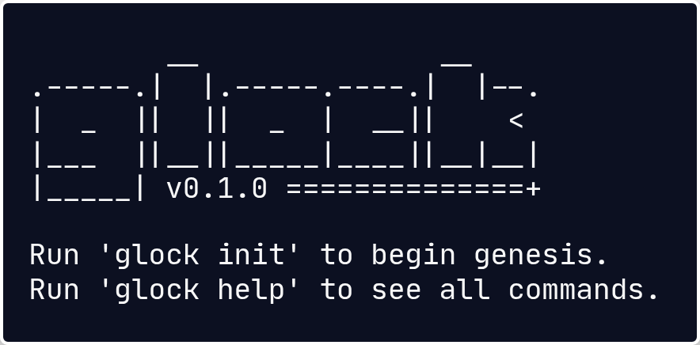

> [!WARNING]
> Have yet to fully test the cli. <br>
> No key elements missing, but it might not look that pretty.

#

<div align="center">

<br>


[](https://github.com/bxavaby/glock/commits/main)

───────────────────

### **glock** is a simple portmanteau that blends _go_ and _block_

<br>



</div>

<br><br>

## Install

Download the latest binary for your platform from [**Releases**](../../releases/latest) and add it to your PATH:

<br>

**Linux (x86_64):**
```
wget https://github.com/bxavaby/glock/releases/latest/download/glock-linux-amd64
chmod +x glock-linux-amd64
sudo mv glock-linux-amd64 /usr/local/bin/glock
```

**Linux (ARM64):**
```
wget https://github.com/bxavaby/glock/releases/latest/download/glock-linux-arm64
chmod +x glock-linux-arm64
sudo mv glock-linux-arm64 /usr/local/bin/glock
```

**macOS (Intel):**
```
curl -LO https://github.com/bxavaby/rnm/releases/latest/download/glock-darwin-amd64
chmod +x glock-darwin-amd64
sudo mv glock-darwin-amd64 /usr/local/bin/glock
```

**macOS (Apple Silicon):**
```
curl -LO https://github.com/bxavaby/glock/releases/latest/download/glock-darwin-arm64
chmod +x glock-darwin-arm64
sudo mv glock-darwin-arm64 /usr/local/bin/glock
```

**Windows (AMD64):**
```
curl -LO https://github.com/bxavaby/glock/releases/latest/download/glock-windows-amd64.exe
chmod +x glock-windows-amd64.exe
move glock-windows-amd64.exe C:\Windows\System32\glock.exe
```

**Windows (ARM64):**
```
curl -LO https://github.com/bxavaby/glock/releases/latest/download/glock-windows-arm64.exe
chmod +x glock-windows-arm64.exe
move glock-windows-arm64.exe C:\Windows\System32\glock.exe
```

<br>

<details>
<summary><b>Build from source (alternative)</b></summary>

<br>

```
git clone https://github.com/bxavaby/glock.git
cd glock
go build -o glock main.go
sudo mv glock /usr/local/bin/
```

</details>

<br>

## Command-line

```
# Initialize blockchain w/ genesis
glock init
```

```
# Mine and add a new block with BPM data
glock add
```

```
# Show chain stats
glock stats
```

```
# Print entire blockchain
glock print
```

```
# Check integrity
glock validate
```

```
# Erase current data
glock reset
```

<br>

> [!NOTE]
> This implementation uses PoW (Proof-of-Work) consensus. <br>
> While Ethereum transitioned to PoS (Proof-of-Stake) in 2022, understanding PoW remains a must.

<br>

<div align="center">
  
───────────────────

**[Report Bug](../../issues)** | **[Suggest Feature](../../issues)**

**MIT License © 2025 bxavaby**

</div>
